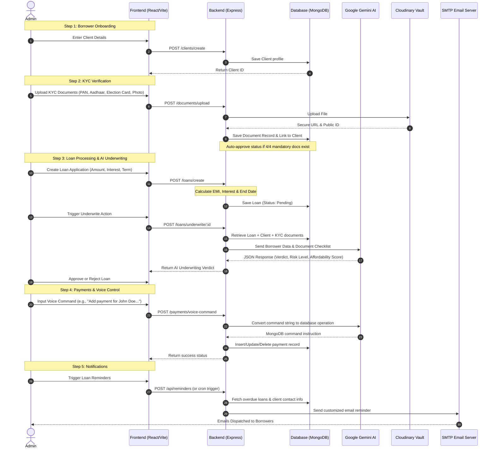

# Project Documentation: AI-Powered Finance & Loan Manager

This document provides a comprehensive overview, workflow description, technical specifications, advantages, and disadvantages of the **AI-Powered Finance & Loan Manager** platform.

---

## 1. Project Overview
The **AI-Powered Finance & Loan Manager** is a premium, full-stack microfinance management system designed to streamline borrower registration, KYC verification, loan accounts creation, amortization, and payment tracking. By integrating **Google Gemini AI**, the platform automates credit risk assessment (underwriting) and simplifies administrative tasks through voice/text commands.

---

## 2. Architecture & Work Flow

The system operates on a client-server architecture with a React-based frontend communicating via REST APIs with an Express.js backend. MongoDB is utilized as the database, and Cloudinary acts as a secure repository for KYC documents.

### System Workflow Diagram

---

## 3. Core Features

### 👤 Borrower Profile & KYC Vault
* **Onboarding & Management**: Complete CRUD operations for client profiles (employment history, credit score, date of birth).
* **Automated KYC Compliance**: Mandatory collection of 4 primary documents: **PAN Card, Aadhaar Card, Election Card, and Profile Photo**. The system automatically transitions the client's status to `Approved` once all four documents are successfully uploaded.
* **Cloudinary Storage**: Offloads local storage to Cloudinary's secure media storage system via Multer upload middleware.

### 🏦 Loan Lifecycle & Amortization
* **Loan Structuring**: Supports Multiple loan categories: **Home, Auto, Personal, Education, and Business**.
* **Automated Math Engine**: A backend Mongoose pre-save hook dynamically calculates:
  * Monthly Equated Monthly Installment (EMI)
  * Total Repayment Obligation
  * Total Interest accrued
  * Maturity/End Date based on Start Date and Term Duration
* **AI Credit Underwriting**: Taps into **Gemini-2.5-Flash** to conduct credit risk analysis, outputting a precise qualitative risk assessment (`Low`, `Medium`, `High`), a numerical `affordabilityScore` (0-100), and a structured `verdict`.

### 💳 Transaction Ledger & AI Voice Command Assistant
* **Transaction Tracking**: Logs client payments against active loans. Supports various methods: **Cash, Bank Transfer, Cheque, Online, and Other**.
* **AI Voice-to-Command Processor**: Admins can state/type a natural command (e.g., *"Update payment for John Doe on 2026-06-04 status to Completed"*). Gemini parses this natural language into strict MongoDB database instructions, automating updates.

### 📧 SMTP Email Communications
* **Client Reminders**: A utility groups loans by borrower and dispatches detailed billing summaries via NodeMailer. Includes tables detailing principal amounts, due EMIs, interest, and end dates.

---

## 4. Tools & Technologies Stack

| Layer | Technology / Tool | Purpose |
| :--- | :--- | :--- |
| **Frontend** | React 19 (Vite) | High-performance user interface framework |
| | Tailwind CSS v4 | Clean, contemporary, responsive dashboard styling |
| | Material UI (MUI) / MUI Joy | Pre-built accessible UI components, forms, tables, and icons |
| | Framer Motion | Premium, smooth interface animations |
| | Chart.js (`react-chartjs-2`) | Data visualizations for loan allocations, payment collections |
| | Axios | AJAX client to communicate with the REST API |
| | XLSX / File Saver | Admin report export features to Microsoft Excel sheets |
| **Backend** | Node.js / Express.js | Core API architecture and middleware pipelines |
| | Mongoose / MongoDB | Document-based data store for sessions, loans, payments, and clients |
| | Nodemailer | E-mail client integration for transaction logs and notifications |
| | Multer / Cloudinary Storage | File parser and remote storage client for KYC assets |
| **AI Integration** | Google GenAI SDK | SDK to access Gemini-2.5-Flash models |
| | Gemini-2.5-Flash | Natural language modeling for Underwriting & Voice-command parsing |

---

## 5. Advantages of the Platform

* **AI-Driven Audits**: Minimizes manual underwriting bottlenecks. It evaluates compliance checklist items and repayment structures in seconds.
* **Precise Math Operations**: Mathematical computations (EMI, Interest, Maturity) are executed at the database schema level (`pre-save` hook), preventing inconsistent rounding or sync bugs between client and server.
* **Improved Admin Experience**: Voice command parsing lets operators edit ledgers without clicking through multiple menus.
* **Robust File Verification System**: Direct integration with Cloudinary keeps the local file system clean and guarantees secure CDN availability of sensitive KYC data.
* **Session Security**: Uses `express-session` backed by `connect-mongo` storing user session states safely within MongoDB.

---

## 6. Disadvantages & Future Scope

* **LLM Non-Determinism**: AI models may occasionally generate unexpected format structures, even with forced JSON schemas. (Mitigated in-system using JSON parsing try-catch blocks and retry mechanisms).
* **Third-Party API Outages**: Critical operations (underwriting, KYC storage, email delivery) rely heavily on Gemini, Cloudinary, and SMTP servers. If one is down, specific system pipelines stall.
* **Voice Transcription Boundary**: The voice-command helper accepts text transcripts rather than raw audio streams directly, requiring browser Speech-to-Text APIs to bridge the gap.
* **Lack of Real-time WebSockets**: Currently relies on client polling to fetch newly added loans/payments rather than real-time pushing.

---
*Created on: June 4, 2026*
